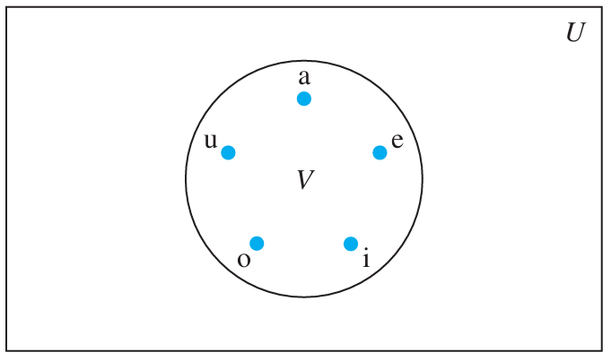

# Sets
## Introduction
- Set is the fundamental discrete structure on which all other discrete structures are built.
- Sets are used to group objects together.
- Often, the objects in a set have similar properties.
  + e.g. all students currently enrolled in BSIT 1st semester make up a set.

## Definition
- A set is an unordered collection of objects, called elements or members of the set.  
- A set is said to contain its elements.
- To denote that `a` is an element of set `B`, write $a \in B$
- The notation $a \not\in B$ denotes that `a` is not an element of the set `B`.

## Different ways to Describe a set

- **Roster method** : when possible list all members of a set e.g. $\lbrace 1, 3, 5, 7, 9 \rbrace$ or $\lbrace a, e, i, o, u\rbrace$
- **Set Builder** : e.g. $\lbrace 1, 3, 5, 7, 9\rbrace$ may be written in set builder notation as $\lbrace x \mid x \text{ is an odd positive integer less than 10} \rbrace$ or $\lbrace x \in \mathbb{Z}^+ \mid x \text{ is odd and } x < 10 \rbrace$ 
- Following sets play an important role in discrete mathematics:

  + $\mathbb{N} = \lbrace 0, 1, 2, 3, ... \rbrace$, the set of **natural numbers**
  + $\mathbb{Z} = \lbrace ..., -2, -1, 0, 1, 2, .... \rbrace$, the set of **integers**
  + $\mathbb{Z}^+ = \lbrace  1, 2, .... \rbrace$, the set of **positive integers**
  + $\mathbb{Q} = \lbrace p/q \mid p \in \mathbb{Z}, q \in \mathbb{Z}, and q \neq 0 \rbrace$, the set of **rational numbers**
  + $\mathbb{R}$, the set of **real numbers**
  + $\mathbb{R}^+$, the set of **positive real numbers**
  + $\mathbb{C}$, the set of **complex numbers**
- **Note: Some people do not consider 0 a natural number, so be carefull when you read other material**

## Intervals

### Real world Analogy
- Suppose a university admit students whose ages fall between 18 and 24 years.
- This naturally leads to the idea of including or excluding endpoints:
  + Including both 18 and 24 = [18, 24]
  + Excluding both 18 and 24 = (18, 24)
  + Including 18 but not 24 = [18, 24)
  + Including 24 but not 18 = (18, 24]
### Visual representation 
- When drawn on number line or graphs following notation is used:
  + a filled circle means inclusion 
  + an unfilled circle means excluded
### Importance in Set Theory
- Intervals are **subsets of real numbers**.
- They model **continuous ranges**
### Applications in computing

| **Domain**       | **Use of Intervals**                        |
|------------------|---------------------------------------------|
| Programming      | Loop conditions: for(i=0; i< 10             |
| Database Systems | SQL: WHERE age BETWEEN 18 AND 30            |
| Web Forms        | Input validation: Accept values in [0, 100] |
| Networking       | IP ranges (interval of addresses)           |

## Sets as members
- sets can have other sets as members
- e.g. $\lbrace \mathbb{N}, \mathbb{Z}, \mathbb{Q}, \mathbb{R} \rbrace$, is a set containing four elements, each of which is a set. 

## Computing concepts built upon the concept of set
- datatype: is the name of a set, together with a set of operations that can be performed on objects of the set.
- e.g. boolean is the name of the set $\lbrace 0, 1 \rbrace$ together with operators on one or more elements of this set, such as AND, OR and NOT.

## Equality of sets

- Two sets are equal **if and only if**
  + they have the same elements.
- in mathematical notation $\forall x(x \in A \leftrightarrow x \in B ) $
- we write $A = B$ if A and B are equal sets.
- $\lbrace 1, 3, 3, 3, 5, 5 \rbrace = \lbrace 1, 3, 5 \rbrace$, it does not matter if an element is listed more than once.
- $\lbrace 1, 3, 5 \rbrace = \lbrace 5, 1, 3 \rbrace$, the order of elements is not important.

## Georg Cantor (1845-1918) Founder of Set Theory

- Georg Cantor is considered the **founder of set theory**
- His contributions include the discovery that the **set of real numbers is uncountable**

## THE EMPTY SET
- It is a set which has no element
- Also called null set, and denoted by $\emptyset$

## SINGLETON SET
- A set with one element is called a **singleton set**

## Venn Diagrams

- Sets can be represented graphically using Venn diagrams
- Named after English mathematician **John Venn**
- In Venn diagrams the **universal set U**, is represented by a **rectangle**
- Inside this rectangle, **circles** or other geometrical figures **are used to represent sets**
- **Points** are used to represent the particular **elements of the set**
